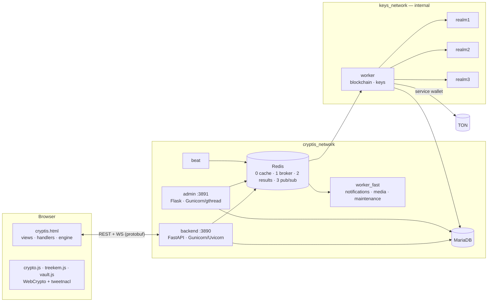

# CryptisDchat


An end-to-end encrypted messenger with a delivery log anchored on the TON blockchain — an
implementation of the technical specification `CryptisDchat_TZ.md` and its appendices
(`Interface_and_API`, `Gunicorn_Celery`, `Ports_and_Database`, `project_structure`).

The user interface is built from the provided mockups `Login.html` and `cryptis.html`: their layout,
CSS classes and re-rendering mechanics are preserved, and the demo data is replaced by the real API.

**[Project documentation](https://drive.google.com/drive/folders/1jvNFLmGvsCVsGoeSogor_gkPvS4btj1P?usp=sharing)**

---

## Current Features

**Sign-in and sessions**
- Sign-in with a TON wallet (TonConnect) verified via `ton_proof`: Ed25519 signature, domain, freshness, wallet `state_init` (v3r2 / v4r2 / v5r1)
- 15-minute JWT + Refresh token, rotated on every exchange; reusing an old token revokes the device
- List of active sessions, "End session", "Log out of all devices"
- One browser = one device: the server issues a device key in an `HttpOnly; SameSite=Strict` cookie
  (rotated on every sign-in, only its SHA-256 is stored), so signing in again from the same browser — even
  after logging out — reuses the same device instead of creating a new one; tokens issued before the logout stay revoked
- Devices with no activity for 30 days are ended automatically every night (e.g. after the browser's site data
  was cleared); signing in from that browser again brings the same device back. Devices revoked more than 400 days ago are deleted
- Linking a second wallet and moving the account to a new wallet

**End-to-end encryption (spec section 6)**
- Identity (ECDH P-256) and Signing (ECDSA P-256) device keys are generated in the browser
- Message content is encrypted with XSalsa20-Poly1305 and every message is ECDSA-signed; an invalid signature hides the message
- Direct-chat Conversation keys are delivered via ECIES (ephemeral ECDH + AES-128-GCM)
- Groups use a TreeKEM-like key tree: a membership change re-encrypts only the affected branch
- Attachments are encrypted on the device with their own key
- Search over encrypted history via a blind index (the server never learns the words)
- Local storage of keys and history in OPFS behind a PIN (AES-256-GCM); wiped after 10 wrong PINs
- Auto-lock after inactivity (1 min / 5 min / 30 min / 1 hour / never)
- Key backup with 2-of-3 Shamir secret sharing across three independent realm services; restore on a new device with the PIN

**TON blockchain (spec section 2)**
- "Sent / delivered / read" events → hashes → Merkle tree → one service-wallet transaction per batch
- Confirmation icon on messages and a "Message info" sheet that verifies the Merkle proof right in the browser
- Group membership changes are separate transactions; keys rotate only after confirmation
- Retries with exponential back-off and manual retry of failed batches from the admin panel

**Messaging**
- Direct chats and groups (creation with a photo, members, invitations, leaving, ownership hand-over)
- Real-time updates over WebSocket (protobuf): new messages, "typing…", delivered / read, online / "last seen recently"
- Replies, forwarding, copying text, files with encrypted upload and download
- Markdown: bold, italic, strikethrough, code with syntax highlighting, quotes, lists, links; live preview
- Disappearing messages (from 5 minutes to 4 weeks after reading)
- Chat list filters (All / Unread / Direct / Groups), search, "Mark all as read", unread counters
- Clearing and deleting conversations, history loaded while scrolling

**Settings and privacy**
- Profile: name, username, avatar; TON address is read-only
- Who can add me to groups: everyone / nobody / allowed people only
- Blocklist of TON addresses
- "Show when I'm online" and read receipts can be turned off
- Media auto-deletion (30 / 60 days, 6 months) and "Delete all media"

**Administration and infrastructure**
- Flask admin panel: users, account suspension, session revocation, reports, blockchain queue, Prometheus metrics
- Admin sign-in with CSRF protection and brute-force lockout; audit log of every admin action
- HMAC-signed webhooks; rate limiting for the API and WebSocket; Origin checks
- 10 Docker containers; Celery with 5 queues, 2 workers and beat; daily MariaDB dump

---

## Quick Start

### Run the whole project in Docker

```bash
scripts/run_gunicorn.sh
```

The script checks that `.env`, `worker.env` and `realm.env` exist in the project root, builds the images
and starts all 10 containers (`db`, `redis`, `backend`, `admin`, `worker`, `worker_fast`, `beat`,
`realm1..3`) in two stages — first `db`, `redis`, `realm1..3`, waiting until MariaDB is ready, then the
application. Finally it checks that **every** container is running (and prints its logs if one failed),
creates the admin-panel user and prints the URLs and password. FastAPI (`backend`) and Flask (`admin`)
run under Gunicorn inside the containers. Other commands: `status`, `logs [service]`, `down`.
Application containers run as the user who started the script (`id -u`/`id -g`), not as root.

| URL | What it is |
|---|---|
| [http://85.95.150.8:3890/](http://85.95.150.8:3890/) | the app: sign-in (`Login.html`) → messenger (`cryptis.html`), API, WebSocket |
| [http://85.95.150.8:3891/admin/](http://85.95.150.8:3891/admin/) | Flask admin panel (login and password are in `.env`: `ADMIN_USERNAME` / `ADMIN_PASSWORD`) |

The current `.env` is set up for a local run (sign-in with the dev wallet). For a production server change
4 lines in `.env`: `APP_ENV=production`, `DEV_WALLET_LOGIN=false`, and set `PUBLIC_ORIGIN` /
`ALLOWED_WS_ORIGINS` and `TON_PROOF_DOMAIN` to your domain. In `production` the services **refuse to
start** with weak secrets or with the dev sign-in enabled.

**worker.env** — secrets for the `worker` container only:

| Variable | Meaning |
|---|---|
| `BLOCKCHAIN_MODE` | `mock` — emulated network (default), `toncenter` — the real TON network |
| `SERVICE_WALLET_MNEMONIC` | 24-word mnemonic of the application's service wallet (quoted) |
| `SERVICE_WALLET_VERSION` | wallet contract: `v4r2` (Tonkeeper) or `v3r2` |
| `TONCENTER_ENDPOINT` | `https://toncenter.com/api/v2` (testnet: `https://testnet.toncenter.com/api/v2`) |
| `TONCENTER_API_KEY` | key from @tonapibot (without it — 1 request per second) |

**realm.env** — `REALM_API_TOKEN` (token shared by the worker and the realms) and `REALM_MAX_ATTEMPTS` (10).
All three files are in `.gitignore`, with `600` permissions.

### Local run without Docker (development)

```bash
python3.12 -m venv .venv && .venv/bin/pip install -r requirements.txt
.venv/bin/python scripts/dev_server.py
```

Starts everything in one terminal: a real Redis (the `redislite` pip package), SQLite instead of MariaDB,
three realm services, Celery worker + beat, the Flask admin panel and FastAPI. The blockchain is mocked
(confirmation after ~3 s), sign-in uses the dev wallet (an Ed25519 key in the browser; the server fully
verifies the `ton_proof` signature). [http://localhost:3890/login?dev=new](http://localhost:3890/login?dev=new) creates another test user.
Admin panel: [http://127.0.0.1:3891/admin/](http://127.0.0.1:3891/admin/), `admin` / `devpassword123`.

### Tests

```bash
.venv/bin/python -m pytest                      # 74 tests: API, worker, admin, WS, crypto compatibility
.venv/bin/python -m playwright install chromium # once
.venv/bin/python scripts/dev_server.py &        # stack for the browser scenario
.venv/bin/python tests/e2e/e2e_browser.py       # end-to-end scenario in Chromium (4 browser profiles)
```

---

## Architecture



* **backend** — the only public entry point: API, WebSocket, pages. It has no access to the wallet
  mnemonic or to the realm services (spec section 7, least privilege).
* **worker** (queues `blockchain`, `keys`) — the only service holding the service-wallet mnemonic and
  network access to the realms; `acks_late`, retries from 30 s to 10 min, then manual handling in the admin panel.
* **worker_fast** (`notifications`, `media`, `maintenance`) — a separate service so that a stuck
  transaction cannot block push notifications (Gunicorn_Celery.md 4.9).
* **Redis Pub/Sub** — a "doorbell" between Gunicorn workers; the database is the source of truth.

## Project Structure

```
CryptisDchat_project/
├── backend/
│   ├── app/
│   │   ├── main.py, config.py
│   │   ├── models/          ORM (26 tables) — shared by FastAPI, Flask and Celery
│   │   ├── schemas/         Pydantic DTOs
│   │   ├── interfaces/      abstractions: blockchain, event bus, task queue, storage, realm, push, ton_proof
│   │   ├── repositories/    SQL queries
│   │   ├── services/        business logic: auth, threads, messages, groups, keys, merkle, treekem …
│   │   ├── api/             dependencies.py, routers/ (60 REST operations + /ws)
│   │   └── proto/           protobuf codec (schema — proto/cryptis.proto)
│   ├── admin_app/           Flask admin panel, webhooks, Flask-WTF forms
│   ├── database/            schema.sql (MariaDB), initial_data.py
│   ├── templates/           login.html, cryptis.html (from the mockups)
│   ├── static/              css/, images/, js/{lib,app,vendor}
│   ├── utils/               logging with token redaction
│   ├── gunicorn.conf.py, gunicorn_admin.conf.py, Dockerfile, requirements.txt
├── worker/                  celery_app.py, tasks/, gateways/ (TON, realm, push), Dockerfile
├── realm/                   secret-share storage service (×3 containers), Dockerfile
├── proto/cryptis.proto      binary transport format (spec 6.2, 6.4)
├── tests/                   pytest, Python↔JS integration (Node), e2e (Playwright)
├── scripts/                 run_gunicorn.sh (runs everything in Docker), dev_server.py (without Docker)
├── logs/{celery,gunicorn}/  logs
├── data_warehouses/         data: redis, uploads, backups
└── docker-compose.yml, .dockerignore, requirements.txt, .env, worker.env, realm.env
```

---

## Security Design

### Sign-in (spec 4.2)
`Connect TON Wallet` → the server issues a one-time payload (HMAC + expiry, single use enforced in Redis) →
the wallet signs `ton_proof` → the server checks the domain, the freshness, that the wallet `state_init`
hashes to the address and contains the claimed key (v3r2/v4r2/v5r1), and the Ed25519 signature →
user (UUID) + **15-minute JWT** + **Refresh token** (a UUID, only its SHA-256 is stored, rotated on every
exchange, reuse = device revocation). "End session" / "Log out of all devices" set a revocation timestamp —
a JWT issued earlier is rejected even before it expires.

### End-to-end encryption (spec 6)
| What | How |
|---|---|
| Device keys | Identity (ECDH P-256) and Signing (ECDSA P-256) are generated in the browser |
| Message | JSON content → **XSalsa20-Poly1305** (Conversation key) → **ECDSA signature** → protobuf |
| Recipient | verifies the signature first and **only then** decrypts; an invalid signature hides the message |
| Direct-chat Conversation key | 32 random bytes, wrapped with **ECIES** (ephemeral ECDH + HKDF + **AES-128-GCM**) for each participant |
| Groups | **TreeKEM-like tree**: membership change → TON transaction → after confirmation the initiating client updates only the leaf's branch (O(log N) encryptions) → epoch key sealed under the new root key |
| Attachments | each file is encrypted with its own random key, which travels inside the encrypted message |
| Search | blind index: HMAC(key, word prefix) — the server compares tokens without knowing the words |
| Local storage (6.5) | keys, refresh token and history in OPFS, AES-256-GCM from PBKDF2(PIN); 10 wrong PINs → wipe; logout → deletion |
| Backup (6.6) | keys are encrypted with a random K; K is split with **2-of-3 Shamir**; each share plus a PIN-derived access key is sealed to its realm's key; 10 wrong PINs → shares destroyed on all realms |

The server stores only ciphertext and public keys; the server code has no path to plaintext.

### Blockchain (spec 2)
Each event (sent / delivered / read) → SHA-256 of the metadata and the ciphertext hash →
Redis queue → Celery Beat every `CHAIN_BATCH_INTERVAL_SECONDS` (or at `CHAIN_BATCH_MAX_ITEMS`) builds a
**Merkle tree** → **one** service-wallet transaction carrying the root → a Merkle proof is stored for every
event. In the app: a chain icon on confirmed messages and "Message info" with hashes, the transaction and
**proof verification right in the browser**. Group membership changes are separate transactions; keys
rotate only after they are confirmed.

---

## Database

`backend/database/schema.sql` — MariaDB 11.4, InnoDB, utf8mb4, UUIDs as `CHAR(36) ascii`, timestamps as
`DATETIME(6)` UTC. `tests/test_schema_sql.py` checks that it matches the ORM.

| Area | Tables |
|---|---|
| Accounts and sessions | `users`, `user_wallets`, `devices`, `refresh_tokens`, `push_tokens` |
| Chats | `threads`, `thread_members` (delivery/read watermarks, clearing, hiding) |
| Groups | `group_membership_events` (TON transactions), `group_tree_nodes`, `group_key_commits` |
| Keys | `user_key_sets`, `conversation_keys`, `key_backups`, `key_backup_shares`, `key_recovery_requests` |
| Messages | `messages` (ciphertext, signature, epoch), `message_search_tokens`, `attachments` |
| Blockchain | `chain_events` (hash, Merkle proof), `chain_batches` (root, transaction) |
| Settings | `user_settings`, `group_invite_allowlist`, `blocklist` |
| Administration | `admin_users`, `admin_audit_log`, `reports` |

## API Endpoints

All endpoints from section 10 of "Interface_and_API.md" are implemented, plus those the encryption
protocol requires. Interactive OpenAPI docs in development mode: [http://85.95.150.8:3890/api/docs](http://85.95.150.8:3890/api/docs).
Every `/api/*` route except sign-in and avatars requires the `Authorization: Bearer <JWT>` header.

### Authentication and sessions

| Method | Path | Purpose |
|---|---|---|
| POST | `/api/auth/ton-proof/challenge` | One-time payload for the wallet to sign |
| POST | `/api/auth/ton-proof/verify` | Verify ton_proof, create the user on first sign-in, issue JWT + Refresh |
| POST | `/api/auth/refresh` | Exchange a Refresh token for a new JWT (Refresh is rotated) |
| POST | `/api/auth/logout` | End the current device's session |
| POST | `/api/auth/logout-all` | Log out of all devices |
| GET | `/api/auth/sessions` | Active devices / sessions |
| DELETE | `/api/auth/sessions/{device_id}` | End a specific device's session |
| POST | `/api/wallet/connect` | Link a new TON wallet (after ton_proof) |
| POST | `/api/wallet/disconnect` | Unlink a wallet (except the last one) |

### Profile and users

| Method | Path | Purpose |
|---|---|---|
| GET | `/api/me` | Own profile: name, username, TON address, key version, backup status |
| PATCH | `/api/me` | Change name / username / bio |
| POST | `/api/me/avatar` | Upload an avatar |
| POST | `/api/me/push-token` | Register the device's push-notification token |
| GET | `/api/contacts?query=` | Search people by name, username or TON address |
| GET | `/api/users/{user_id}` | A user's public profile |
| GET | `/api/media/avatars/{upload_id}` | Avatar (by an unguessable UUID, no token needed) |
| POST | `/api/reports` | Report a user / chat / message |

### Chats

| Method | Path | Purpose |
|---|---|---|
| GET | `/api/threads?filter=&query=` | Chat list (all / unread / direct / groups) |
| POST | `/api/threads` | Open or create a direct chat with a user |
| GET | `/api/threads/{thread_id}` | Chat details and members |
| DELETE | `/api/threads/{thread_id}` | Delete the conversation for yourself |
| POST | `/api/threads/{thread_id}/clear` | Clear messages |
| POST | `/api/threads/{thread_id}/mute` | Turn chat notifications on / off |
| POST | `/api/threads/{thread_id}/read` | Mark as read (the receipt goes to the blockchain log) |
| PATCH | `/api/threads/{thread_id}/disappearing` | Disappearing-messages timer |
| PATCH | `/api/threads/{thread_id}/screenshot-block` | Screenshot-block flag (hidden in the UI) |

### Groups

| Method | Path | Purpose |
|---|---|---|
| POST | `/api/groups` | Create a group (membership is recorded by a TON transaction) |
| PATCH | `/api/groups/{group_id}` | Change title / photo (admins) |
| GET | `/api/groups/{group_id}/members` | Members |
| POST | `/api/groups/{group_id}/members` | Add members |
| DELETE | `/api/groups/{group_id}/members/{user_id}` | Remove a member or leave the group |

### Messages and attachments

| Method | Path | Purpose |
|---|---|---|
| GET | `/api/threads/{thread_id}/messages?before=&limit=` | History, cursor pagination |
| POST | `/api/threads/{thread_id}/messages` | Send an encrypted packet (`application/x-protobuf` or JSON) |
| GET | `/api/threads/{thread_id}/messages/search?q=` | Blind-index search |
| POST | `/api/messages/{message_id}/forward` | Forward (re-encrypted with the target chat's key) |
| POST | `/api/uploads` | Upload an encrypted file / group avatar |
| GET | `/api/messages/{message_id}/attachment` | Download an encrypted attachment |
| GET | `/api/messages/{message_id}/proof` | Hashes, batch, TON transaction and Merkle proof of a message |

### Encryption keys

| Method | Path | Purpose |
|---|---|---|
| POST | `/api/keys` | Publish public Identity and Signing keys (new version) |
| GET | `/api/keys/{user_id}?version=` | A user's public keys |
| GET | `/api/threads/{thread_id}/keys` | Own wrapped (ECIES) Conversation keys of a direct chat |
| POST | `/api/threads/{thread_id}/keys` | New Conversation-key epoch for the participants |
| GET | `/api/groups/{group_id}/keys/plan` | Plan of the affected branch of the group key tree |
| POST | `/api/groups/{group_id}/keys/commit` | Commit a branch update (new group-key epoch) |
| GET | `/api/groups/{group_id}/keys/commits?since=` | Tree commits for synchronisation |
| GET | `/api/keys/realms` | Public keys of the realm services |
| GET | `/api/keys/backup` | Backup metadata and ciphertext |
| POST | `/api/keys/backup` | Create a backup (Shamir shares sealed to the realms) |
| POST | `/api/keys/recovery` | Start key recovery on a new device |
| GET | `/api/keys/recovery/{request_id}` | Recovery result (shares or remaining attempts) |
| DELETE | `/api/keys/recovery/{request_id}` | Finish recovery and erase the result |

### Settings and blocklist

| Method | Path | Purpose |
|---|---|---|
| GET | `/api/settings` | All account settings |
| PATCH | `/api/settings` | Change settings |
| POST | `/api/settings/delete-media` | Delete all of your media on the server |
| GET | `/api/settings/group-invite-allowlist` | Who may add you to groups |
| POST | `/api/settings/group-invite-allowlist/{user_id}` | Allow |
| DELETE | `/api/settings/group-invite-allowlist/{user_id}` | Disallow |
| GET | `/api/blocklist` | Blocked users |
| POST | `/api/blocklist/{user_id}` | Block |
| DELETE | `/api/blocklist/{user_id}` | Unblock |

### WebSocket — `/ws`

Binary `WsFrame` frames (`proto/cryptis.proto`); the first frame is `auth` with the JWT, and `Origin` is checked.

| Direction | Events |
|---|---|
| client → server | `auth`, `heartbeat`, `typing.start`, `typing.stop`, `ack.delivered` |
| server → client | `ready`, `message.new`, `message.delivered`, `message.read`, `message.confirmed`, `thread.updated`, `typing.start`, `typing.stop`, `key.rotation`, `session.revoked`, `error` |

### Pages

| Method | Path | Purpose |
|---|---|---|
| GET | `/login` | Sign-in screen (`Login.html`) |
| GET | `/app` | Messenger (`cryptis.html`) |
| GET | `/tonconnect-manifest.json` | TonConnect manifest |
| GET | `/healthz` | Liveness check |

### Flask — admin panel and webhooks (`:3891`)

| Method | Path | Purpose |
|---|---|---|
| GET, POST | `/admin/login` | Admin sign-in (CSRF, brute-force lockout) |
| POST | `/admin/logout` | Log out |
| GET | `/admin/` | Summary metrics and audit log |
| GET | `/admin/users` | Search by UUID, TON address, username |
| GET | `/admin/users/<uuid>` | User card: wallets, devices, refresh tokens |
| POST | `/admin/users/<uuid>/suspend` | Suspend the account |
| POST | `/admin/users/<uuid>/unsuspend` | Restore the account |
| POST | `/admin/users/<uuid>/revoke-sessions` | Revoke all sessions |
| GET | `/admin/reports` | Reports |
| GET, POST | `/admin/reports/<id>` | Handle a report |
| GET | `/admin/blockchain-queue` | TON write queue |
| POST | `/admin/blockchain-queue/retry/<batch_id>` | Retry a failed batch |
| POST | `/admin/blockchain-queue/retry-membership/<event_id>` | Retry a group-membership transaction |
| GET | `/admin/metrics` | Metrics in Prometheus format |
| POST | `/webhooks/ton-tx-status` | TON transaction status (HMAC signature) |
| POST | `/webhooks/tonconnect` | TonConnect bridge callbacks (HMAC signature) |
| GET | `/healthz` | Liveness check |

---

## Design Decisions and Deviations from the Documents

* **The Flask admin panel** is a separate `admin` service (Gunicorn_Celery.md 2.2); it was not listed in
  "Ports_and_Database"; port `3891`.
* **Two workers**, `worker` / `worker_fast`, instead of one — as recommended in Gunicorn_Celery.md 4.9.
* **Three realms** in their own `internal` network; the realm key is a 0600 file (a software HSM equivalent).
* The `db` (3306) and `redis` (6390, 8096) ports are published to the host as in "Ports_and_Database"; on a
  production server they must be closed with a firewall (the document says "never exposed").
* Database passwords come from `.env` rather than plain text in the compose file
  (the document itself pointed out that risk).
* Logs: host `logs/` (project structure) ↔ container `/app/data_warehouses/...` (Gunicorn config).
* The schema is mounted from `backend/database/schema.sql` (per the project structure).
* **The PIN is the only local secret** (4 digits); the "Password" screen from the mockup's profile panel
  is not used — as suggested in Interface_and_API.md section 5.
* Profile editing is for your own profile (Settings → Account); a chat partner's profile is view-only;
  group admins can change the group title and photo. "Delete conversation" for a group means leaving it.
* Added: device sessions, "Lock now", "online" and "read receipts" toggles, "typing…", delivery statuses
  and the blockchain proof sheet (everything Interface_and_API.md section 8 listed as missing from the mockup).
* Push previews: the client **does not send** plaintext — the server sends "New message" (stricter than spec section 5 allows).
* Avatars are not end-to-end encrypted (a public part of the profile) and are served by an unguessable UUID.
* "Delete all media" deletes the user's encrypted blobs **on the server** (Gunicorn_Celery.md 4.7).

---

## Application Notes

- **Default mode.** `.env` is set up for a local run: `APP_ENV=development`, sign-in with the dev wallet.
  Real TON wallets only work with a public HTTPS domain — for a production server set the domain in
  `PUBLIC_ORIGIN`, `ALLOWED_WS_ORIGINS`, `TON_PROOF_DOMAIN` and turn off `DEV_WALLET_LOGIN`.
- **Blockchain.** By default `BLOCKCHAIN_MODE=mock` — the network is emulated. To write to the real TON
  network, fund the service wallet, put its mnemonic into `worker.env` and switch to `toncenter`.
- **PIN.** The 4-digit PIN is set on first sign-in and is needed to unlock the app and to restore keys on
  a new device. The server does not store it: a forgotten PIN cannot be recovered.
- **Logging out** deletes all local data from the device — keys and decrypted history.
- **The first Docker start** takes a few minutes: building the images and initialising MariaDB from
  `backend/database/schema.sql`. The schema is applied only to an empty `mariadb_data` volume.
- **Secrets** live in `.env`, `worker.env` and `realm.env` — they never go into git or Docker images.
- **Logs**: Gunicorn — `logs/gunicorn/`, Celery — `logs/celery/`; database dumps — `data_warehouses/backups/`.

## Author

Developed by **Aleynikov Aleksandr** — infrastructure, Python back end, the cryptographic protocol and security\
Contact: [aleynikov.aleksandr@icloud.com](mailto:aleynikov.aleksandr@icloud.com)

Co-author: **Skripka Artyom Aleksandrovich** — admin panel development, risk analysis, UI and database
design, client-side development and testing\
Profile: [newlxp.ru/user/21d7e9e8-f5c5-4df9-a520-52e833d16fac](https://newlxp.ru/user/21d7e9e8-f5c5-4df9-a520-52e833d16fac)
